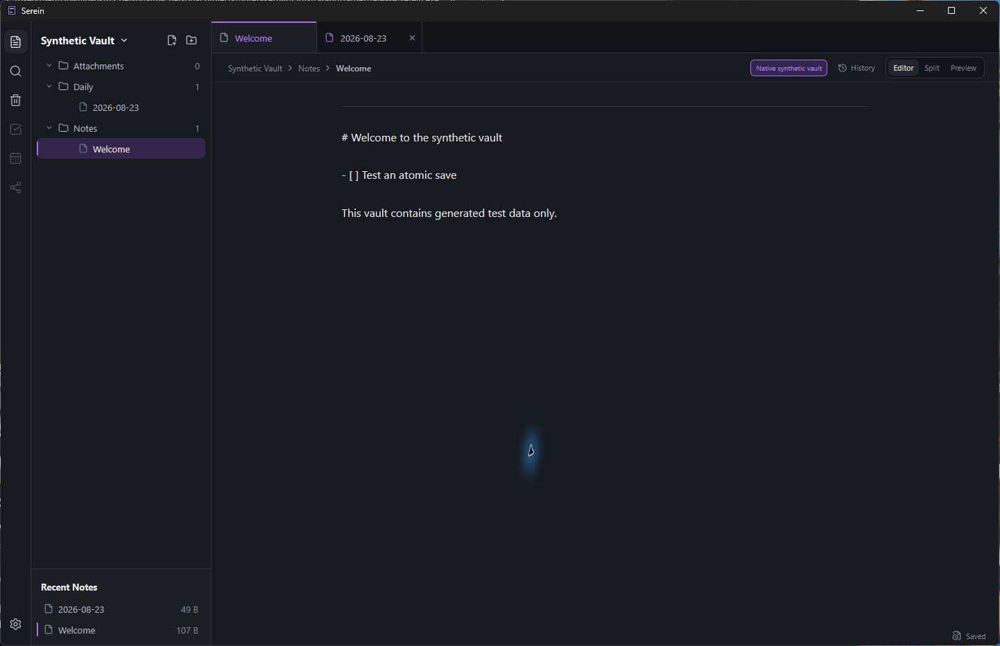
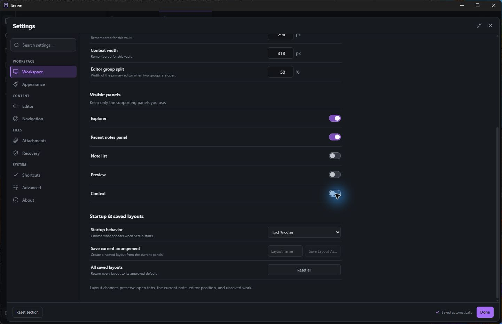
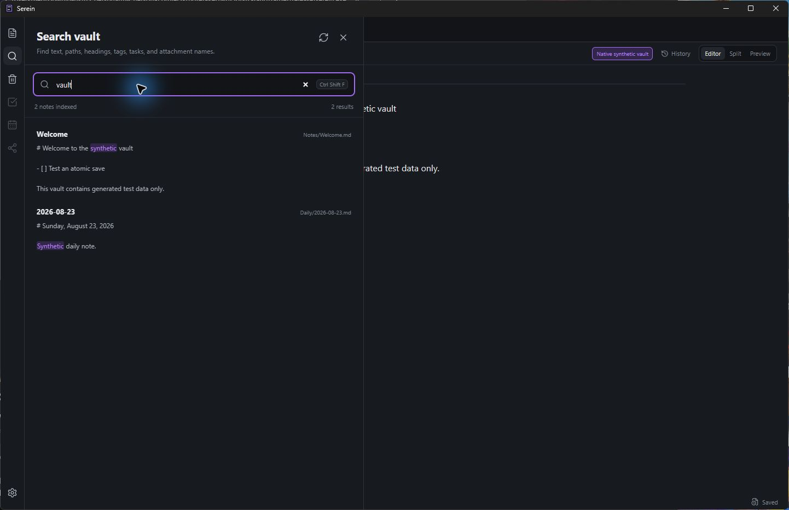
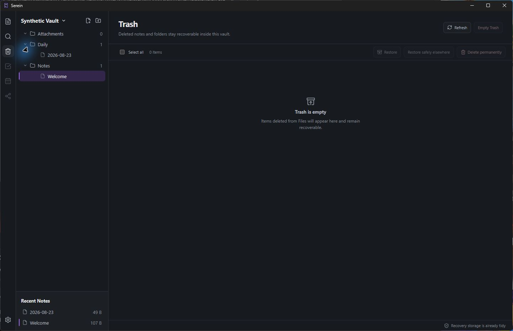

# Serein

> A quiet, local-first workspace for your thoughts.

Built around plain Markdown files, Serein keeps your notes, ideas, and knowledge close to you.

No account. No AI. No cloud dependency. Just your files.

## Implemented in this preview

- Native Windows desktop application
- Generated local Markdown test vaults with safe, atomic editing
- Fast full-text search
- Attachments with relative Markdown links
- Tabs, split editing, and Editor / Split / Preview modes
- Version history, recovery, and restorable Trash
- Customizable workspace layouts, themes, and shortcuts
- Offline-first by design, with zero telemetry

## Screenshots

| Main workspace | Settings |
| --- | --- |
|  |  |

| Search | Recovery |
| --- | --- |
|  |  |

## Current status

Serein 0.1.0 is an early technical preview. The Markdown editing, search, attachments, recovery, workspace, and customization foundation is in place, but this build intentionally opens only generated Serein test vaults carrying its synthetic-vault marker.

It does **not** yet open arbitrary personal folders or existing vaults. This restriction remains until copied-vault acceptance and the remaining Windows packaging checks pass.

Future phases are planned to add Daily Notes, Calendar, Tasks, backlinks, and a knowledge graph. They are not part of this preview yet.

## Installation

Download one of the Windows artifacts from the repository's Releases page:

- **Setup** — run `Serein-0.1.0-Windows-x64-Setup.exe` for a normal per-user installation.
- **Portable** — extract `Serein-0.1.0-Windows-x64-Portable.zip` and run `Serein.exe`.

Launch Serein and use its generated test vault. Do not add the synthetic marker to a personal folder to bypass the preview restriction. When existing-vault opening is enabled in a later preview, test with a disposable copy first and keep a separate backup of anything you cannot replace.

The preview is unsigned, so Windows may show a reputation warning. Verify that the filename and checksum match the published release before running it.

## Why Serein exists

A personal note-taking tool should not require handing your thoughts to a service. Serein is built around ownership, simplicity, and files that remain accessible outside the app—without a proprietary note database or cloud lock-in.

## Development

Serein uses Tauri 2, Rust, React, and TypeScript. The packaged desktop app embeds the production frontend and does not depend on a development server, Python, FastAPI, PyWebView, or localhost.

```powershell
npm install
npm test
npm run test:native
npm run build
```

Release packaging details live in [docs/PACKAGING.md](docs/PACKAGING.md).

## License

Serein is available under the [MIT License](LICENSE).
